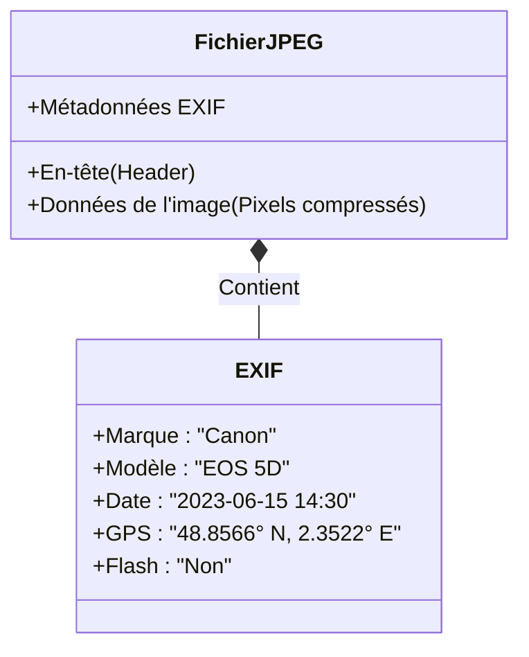

# 1. La vision humaine et les couleurs

L'œil humain perçoit la lumière grâce à deux types de cellules situées sur la rétine :

1.  **Les bâtonnets** : Très sensibles à la lumière (vision nocturne), ils ne perçoivent pas les couleurs (vision en niveaux de gris).
2.  **Les cônes** : Moins sensibles, ils permettent la vision des couleurs. Il en existe trois types, sensibles respectivement au **Rouge**, au **Vert** et au **Bleu**.

> **Analogie** : L'appareil photo numérique fonctionne sur le même principe que l'œil.

| Composant | Fonction | Équivalent photo |
|-----------|----------|------------------|
| **Cornée** | Convergence des rayons lumineux | Lentille frontale |
| **Iris** | Contrôle de la quantité de lumière | Diaphragme |
| **Cristallin**| Mise au point (accommodation) | Système de focus |
| **Rétine** | Surface sensible captant l'image | Capteur (CCD ou CMOS) |

# 2. La synthèse additive (RVB)

Les écrans (ordinateur, smartphone, TV) utilisent la **synthèse additive** des couleurs.
On superpose trois lumières primaires : **Rouge**, **Vert**, **Bleu** (RVB ou RGB en anglais).

- **Rouge** + **Vert** = **Jaune**
- **Rouge** + **Bleu** = **Magenta**
- **Vert** + **Bleu** = **Cyan**
- **Rouge** + **Vert** + **Bleu** = **Blanc**
- Absence de lumière = **Noir**

# 3. Le codage des couleurs

Chaque pixel d'une image couleur est composé de 3 sous-pixels (Rouge, Vert, Bleu).
L'intensité de chaque composante est codée généralement sur **1 octet** (8 bits), soit une valeur entre 0 et 255.

Un pixel couleur est donc codé sur **3 octets** (24 bits).

- Composante Rouge ($R$) : 0 à 255
- Composante Verte ($V$ ou $G$) : 0 à 255
- Composante Bleue ($B$) : 0 à 255

On note souvent la couleur d'un pixel sous la forme $(R, V, B)$.

### Quelques couleurs classiques :

| Couleur | Code RVB (Décimal) | Code Hexadécimal |
|---------|-------------------|------------------|
| **Noir** | (0, 0, 0) | #000000 |
| **Blanc** | (255, 255, 255) | #FFFFFF |
| **Rouge** | (255, 0, 0) | #FF0000 |
| **Vert** | (0, 255, 0) | #00FF00 |
| **Bleu** | (0, 0, 255) | #0000FF |
| **Jaune** | (255, 255, 0) | #FFFF00 |
| **Magenta**| (255, 0, 255) | #FF00FF |
| **Cyan** | (0, 255, 255) | #00FFFF |
| **Gris moyen**| (128, 128, 128) | #808080 |

# 4. Poids d'une image

Le poids (ou taille en mémoire) d'une image dépend de sa définition et de sa profondeur de couleur.

$$ \text{Poids (bits)} = \text{Nombre de pixels} \times \text{Taille d'un pixel (bits)} $$

Pour une image couleur standard (24 bits/pixel) :

$$ \text{Poids (octets)} = \text{Nombre de pixels} \times 3 $$

*Exemple :* Une image de $800 \times 600$ pixels en couleur pèse :
$480 000 \times 3 = 1 440 000 \text{ octets} \approx 1,44 \text{ Mo}$ (sans compression).

# 4.5 Traitement d'image : Les Filtres

Une fois l'image numérisée, on peut modifier ses couleurs grâce à des opérations mathématiques sur chaque pixel. C'est ce que font les filtres Instagram !

### Exemple : Le Noir et Blanc
Pour passer une image couleur en noir et blanc (niveaux de gris), on remplace les valeurs R, V, B par leur moyenne.
$$ Gris = \frac{R + V + B}{3} $$

<FilterPlayground />

# 5. La Compression d'Image

Pour réduire le poids des images (et les envoyer plus vite sur Internet), on utilise des algorithmes de compression.

### 💾 Comparaison des formats

- **RAW / BMP** : Aucune compression. Qualité parfaite, mais fichier énorme.
- **PNG (Portable Network Graphics)** : Compression **sans perte**. Idéal pour les graphiques, logos, schémas.
- **JPEG (Joint Photographic Experts Group)** : Compression **destructive**. L'ordinateur supprime des nuances de couleurs invisibles à l'œil nu. Idéal pour les photos.

<ImageCompression />

# 5.5 Les Métadonnées (EXIF)

Un fichier image ne contient pas que des pixels ! Il contient aussi des informations cachées appelées **métadonnées** (format **EXIF**).

Elles peuvent révéler :
*   La marque de l'appareil photo.
*   La date et l'heure de la prise de vue.
*   Les réglages (flash, exposition).
*   📍 **La géolocalisation GPS** exacte de la photo !

> **⚠️ Danger Vie Privée** : Si vous postez une photo prise chez vous sur un réseau social sans "nettoyer" les métadonnées, n'importe qui peut retrouver votre adresse.
> *(Voir le chapitre [Localisation](./Cours_Localisation.md) pour en savoir plus)*.

# 6. Droit à l'image

En France, chacun a le droit exclusif sur son image et l'utilisation qui en est faite.
Avant de publier une photo sur un réseau social (Snapchat, Instagram...), vous devez vous poser les bonnes questions.

<ImageRights />

> **⚖️ La Loi**
>
> Publier la photo de quelqu'un sans son accord (dans un lieu privé) est un délit puni d'un an d'emprisonnement et de 45 000 € d'amende (Article 226-1 du Code Pénal).
