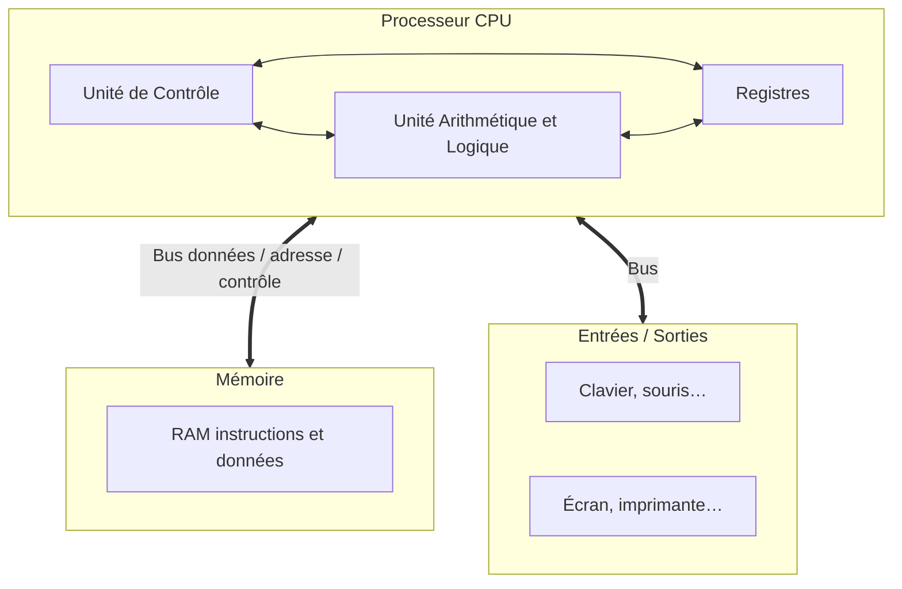

# Modèle de Von Neumann

## Objectifs

- Identifier les **quatre blocs** du modèle de von Neumann
- Décrire le rôle de l'UAL, de l'UC, de la mémoire et des bus
- Comprendre le cycle **fetch → decode → execute → store**
- Situer la limite du modèle (goulot d'étranglement)

## Idée clé

Un ordinateur moderne exécute des programmes **stockés en mémoire** (données **et** instructions au même endroit), de façon **séquentielle** : une instruction après l'autre, pilotée par l'unité de contrôle.

## Quatre composants

John von Neumann formalise une architecture reprise par l'EDVAC : calcul en binaire + **programme en mémoire**.

### Processeur : UAL + UC

- **UAL** : opérations arithmétiques, logiques, comparaisons, décalages ; s'appuie sur des **registres** (mémoire ultra-rapide interne)
- **UC** : orchestre le déroulement — lit l'instruction, la décode, commande l'UAL, écrit le résultat

Cycle de l'UC :

1. **Fetch** — lire l'instruction en mémoire
2. **Decode** — interpréter l'opcode / les opérandes
3. **Execute** — faire calculer l'UAL
4. **Store** — ranger le résultat (registre ou mémoire)

La cadence est donnée par l'horloge (souvent en **GHz**).

### Mémoire

| Type | Rôle |
|---|---|
| **Cache** | Très proche du CPU, accélère les accès répétés |
| **RAM** | Volatile, programmes et données en cours |
| **ROM** | Non volatile, démarrage (firmware / BIOS) |
| **Stockage** | Disque, SSD, USB — long terme |

Dans le modèle, instructions et données cohabitent en RAM : c'est le **programme enregistré**.

### Bus et périphériques

- **Bus de données** : transporte les valeurs
- **Bus d'adresses** : indique *où* lire / écrire
- **Bus de contrôle** : signaux lecture, écriture, etc.

Entrées (clavier…), sorties (écran…), ou les deux (écran tactile, disque).

## Limite : le goulot d'étranglement

CPU, mémoire et bus n'ont pas les mêmes débits. Le plus lent **bride** l'ensemble (bottleneck) — comme un tuyau trop étroit dans une canalisation. Exemple : un CPU très rapide freiné par une mémoire ou un bus trop lents.

## Piège fréquent

Croire que « plus de GHz » suffit toujours. Sans mémoire et bus adaptés, le processeur attend : le modèle séquentiel reste limité par les transferts.

## À retenir

- Quatre blocs : processeur (UC + UAL), mémoire, bus, entrées/sorties
- Programme et données en mémoire (von Neumann)
- Cycle UC : fetch → decode → execute → store
- UAL calcule ; UC séquence
- RAM volatile vs stockage / ROM non volatiles
- Bottleneck = composant le plus lent qui limite le système

## Pour s'entraîner

Poursuivre avec [Circuits électroniques](/cours/2/archi_circuits) puis les [exercices sur les circuits](/cours/2/archi_circuits_exercices).
